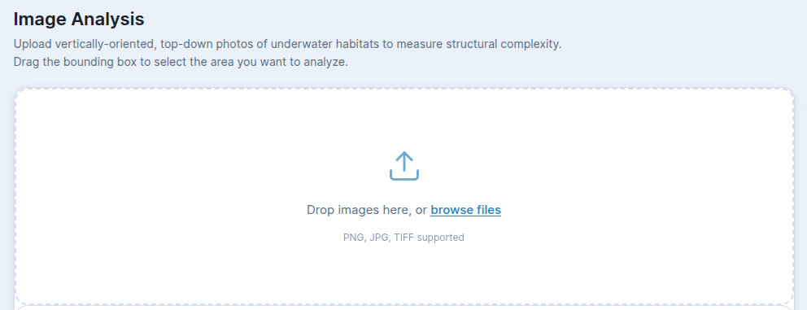
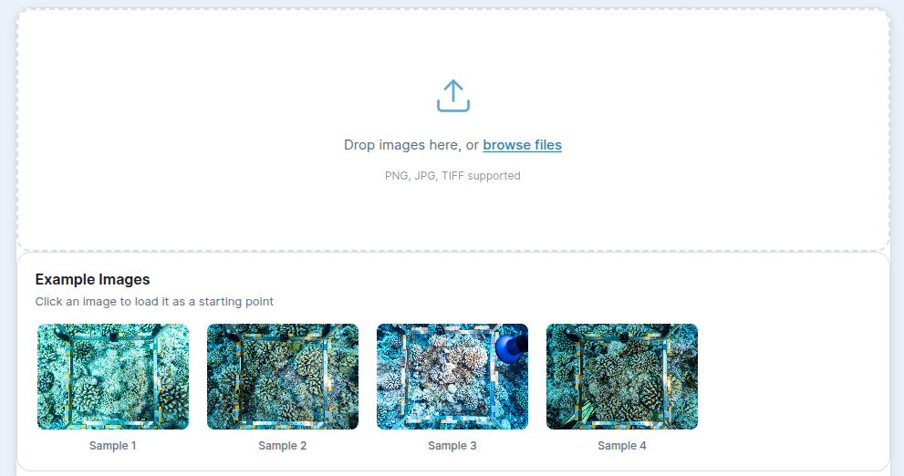
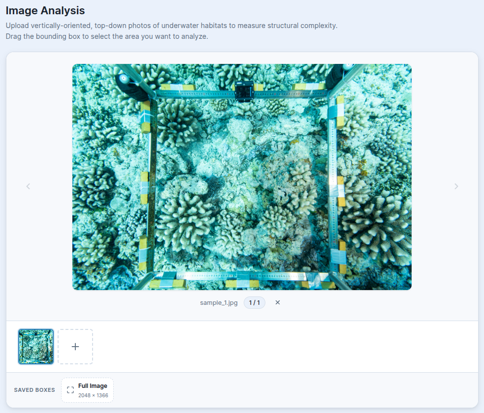
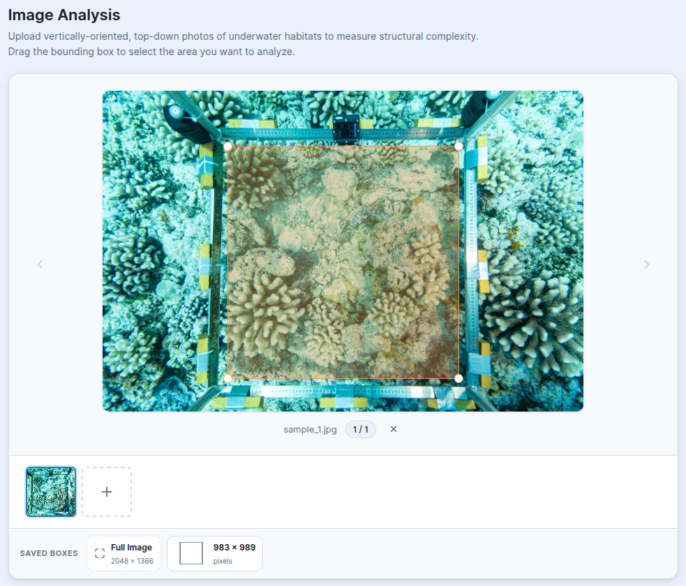
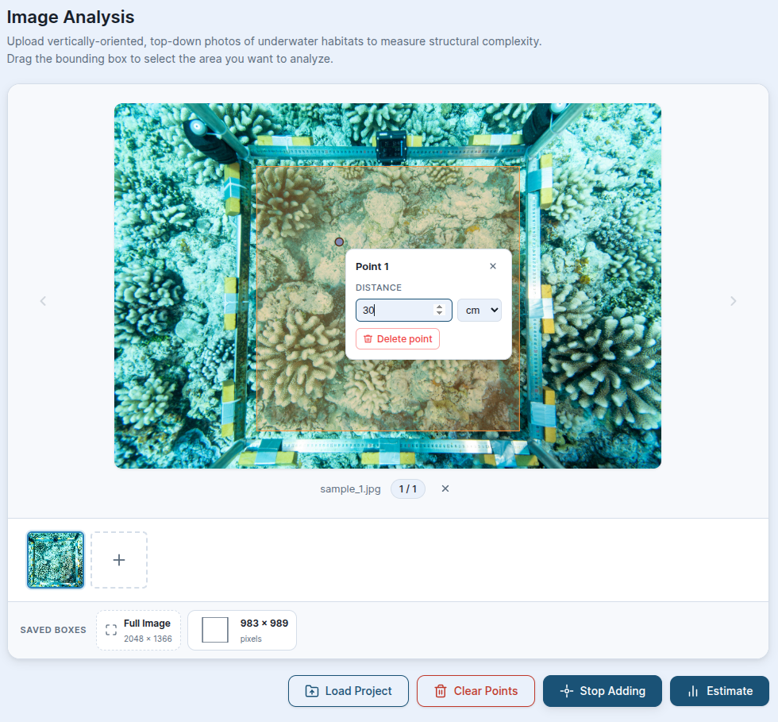
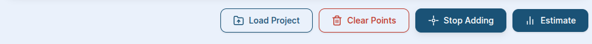
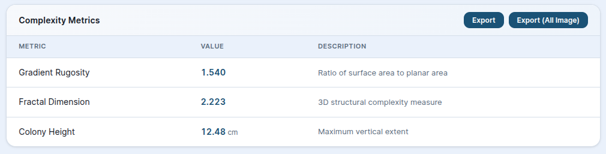
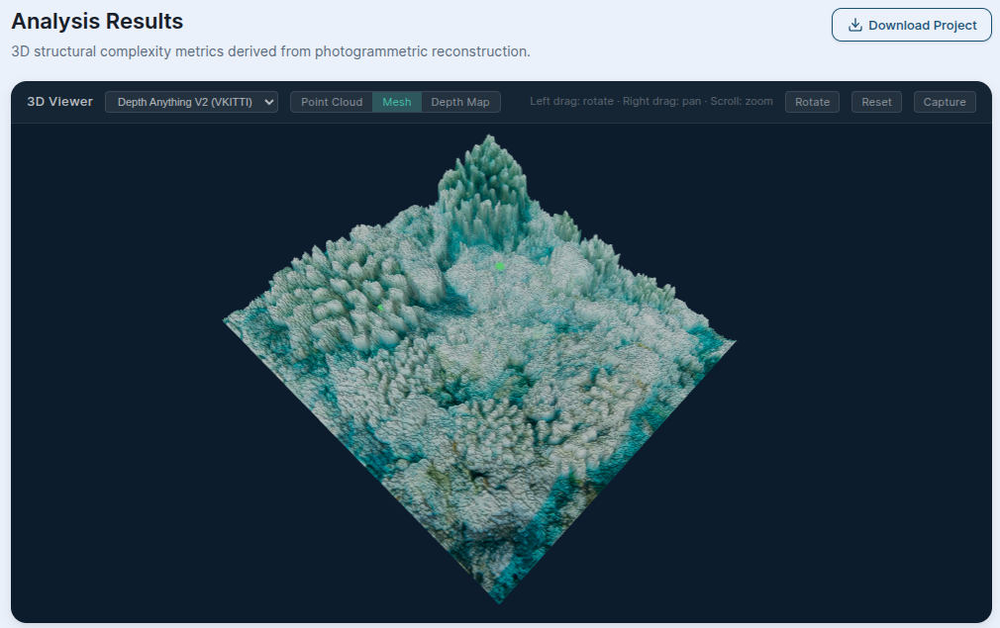
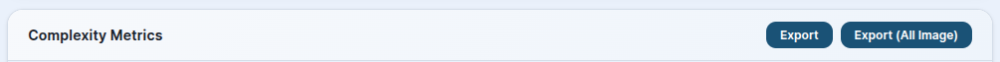
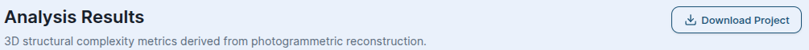

# BenthicComplexVision (BCV) — User Guide

**BenthicComplexVision (BCV)** is an open-access, AI-based web tool that estimates the
**structural complexity** of benthic habitats from a **single top-down image**. In a few
seconds it produces three key metrics — **Gradient Rugosity**, **Fractal Dimension**, and
**Colony Height** — together with an interactive 3D reconstruction of the surface.

This guide walks you through the complete workflow, from opening the page to exporting your
results.

---

## Table of Contents

1. [Overview of the Workflow](#1-overview-of-the-workflow)
2. [Step 1 — Add an Image](#2-step-1--add-an-image)
3. [Step 2 — Navigate and Zoom](#3-step-2--navigate-and-zoom)
4. [Step 3 — Set the Real-World Scale (Reference Points)](#4-step-3--set-the-real-world-scale-reference-points)
5. [Step 4 — Draw a Bounding Box](#5-step-4--draw-a-bounding-box)
6. [Step 5 — Run the Estimate](#6-step-5--run-the-estimate)
7. [Step 6 — Read the Complexity Metrics](#7-step-6--read-the-complexity-metrics)
8. [Step 7 — Explore the 3D Viewer](#8-step-7--explore-the-3d-viewer)
9. [Exporting Results](#9-exporting-results)
10. [Saving and Loading Projects](#10-saving-and-loading-projects)
11. [Working with Multiple Images](#11-working-with-multiple-images)
12. [Troubleshooting & Tips](#12-troubleshooting--tips)

---

## 1. Overview of the Workflow

The tool guides you through a simple, repeatable sequence:

1. Add Image
2. Set Area of Interest
3. Set Refernece Point (Optional)
4. Estimate Structural Complexity
5. Explort / Save Project

You can analyse one image or batch several images in a single project, switching between them
at any time. Each image keeps its own reference points, bounding box, depth map, and results.

---

## 2. Step 1 — Add an Image

When you first open BCV, the image panel is empty and offers three ways to get started.

### Option A — Upload your own image
- **Drag and drop** one or more image files onto the drop area, **or**
- Click **"browse files"** to open your file picker.
- Supported formats: **PNG, JPG, TIFF**.

> 💡 **Tip:** For the most accurate results, use a clear, well-lit, **top-down** image where the
> seabed/colony fills most of the frame and the camera is roughly parallel to the surface.

### Option B — Use a built-in example for quick demostration
If you just want to try the tool, load one of the four bundled sample images. Each sample has
a **"Load"** button that adds it straight into your project.

### Option C — Open a saved project
If you have a previously saved `.mbct` project file, click **"Load existing project (.mbct)"**
(or drag the `.mbct` file onto the drop area) to restore all of its images, annotations, and
results. See [Saving and Loading Projects](#10-saving-and-loading-projects).

---

## 3. Step 2 — Navigate and Zoom

Once an image is loaded, it appears in the large central viewer with a thumbnail strip below.

| Action | How |
|---|---|
| **Zoom in / out** | Scroll the mouse wheel over the image (5%–100% of full size) |
| **Pan** | Hold the middle / right mouse button and drag |
| **Reset zoom to fit** | Double-click the image |
| **Switch images** | Click a thumbnail, or use the on-image **◀ / ▶** arrows |
| **Add more images** | Click the **+** ("Add more") tile in the thumbnail strip |
| **Remove current image** | Click the **✕** button near the image info |

The image info area shows the current filename and position in the set (for example, `1 / 4`).

---

## 4. Step 3 — Draw a Bounding Box

The **bounding box** defines the rectangular region of the image that will be analysed. A
bounding box is **required** before you can run an estimate.

### Draw a box
- **Left-click and drag** on the image to draw a rectangle. Release to finalise it.
- The minimum size is a few pixels — make the box large enough to enclose the structure you care
  about.

### Adjust a box
- **Move:** click and drag the centre of the box.
- **Resize:** drag any of the four corner handles.

### Reuse boxes (Saved Boxes)
- Every box you draw is automatically stored in the **Saved Boxes** list, which shows a preview
  and the box's pixel dimensions.
- Click a saved box to re-apply it (centred) to the current image — handy for keeping a
  consistent analysis area across multiple images.
- Use **"Full Image"** to set the bounding box to the entire image.
- Remove a saved template with its **✕** button.

---

## 5. Step 4 — Set the Real-World Scale (Optional)

Because a photo has no inherent size, BCV needs at least **two reference points** with a known
real-world distance between them to calibrate scale. This is what makes **Colony Height** (and
the absolute geometry of the 3D model) meaningful.

### Place reference points
1. Click **"Add Point"** (the target icon). The button switches to **"Stop Adding"** while you
   are in point-placement mode.
2. Click on the image to drop a point. Points appear as **green circles**.
3. Place **at least two** points at locations whose real-world separation you know (for example,
   the two ends of a ruler or scale bar laid in the scene).

### Enter the distance for a point
1. Click a placed point — it turns **blue** to show it is selected and a small popup opens.
2. In the popup (labelled **"Point 1"**, **"Point 2"**, …), type the **distance** value.
3. Choose the **unit** from the dropdown: **cm**, **mm**, or **m**.
4. Press **Enter** (or click away) to save. Use the popup's delete control to remove a single
   point.

### Manage points
- **"Clear Points"** removes all reference points on the current image. (Disabled when there are
  none.)
- Click **"Stop Adding"** when you are finished placing points so that normal click/drag returns
  to bounding-box editing.

> ⚠️ **Important:** If fewer than two reference points are set, BCV still computes rugosity and
> fractal dimension (which are scale-independent), but scaled outputs such as colony height
> depend on having a valid two-point scale.

---

## 6. Step 5 — Run the Estimate

When you have (1) an image, (2) at least two reference points with distances, and (3) a bounding
box, click **"Estimate"** (the bar-chart icon).

BCV then performs two operations automatically:

1. **Depth prediction** — an AI depth model reconstructs the 3D shape of the cropped region.
2. **Complexity analysis** — the metrics are computed from that depth map and your reference
   scale.

While it runs, the 3D Viewer shows a spinner and the label **"Estimating…"** (this typically
takes only a few seconds).

> 💡 **Re-running:** If you only change the reference points, BCV re-computes the metrics using
> the existing depth map (fast). If you change the image, bounding box, or depth model, it runs a
> full new depth prediction.

---

## 7. Step 6 — Read the Complexity Metrics

After estimation, the **Complexity Metrics** table (the Analysis Report) appears with three
rows:

| Metric | What it means | Format |
|---|---|---|
| **Gradient Rugosity** | Ratio of surface area to planar area (higher = rougher) | 3 decimals |
| **Fractal Dimension** | 3D structural complexity measure | 3 decimals |
| **Colony Height** | Maximum vertical extent | 2 decimals, shown in your chosen unit (cm/mm/m) |

---

## 8. Step 7 — Explore the 3D Viewer

The **3D Viewer** shows an interactive reconstruction of the analysed region. Use the toggle
buttons at the top to switch between three modes:

- **Point Cloud** — the 3D points, textured with the original image colours.
- **Mesh** — a shaded, triangulated surface.
- **Depth Map** — a 2D heatmap of depth (red = closest, blue = farthest).

Your reference points appear as **green spheres** in every mode so you can see where they sit on
the surface.

### Camera controls
The hint bar reads: **"Left drag: rotate · Right drag: pan · Scroll: zoom"**.

| Control | Action |
|---|---|
| **Left-click drag** | Rotate the model |
| **Right-click / middle drag** | Pan the view |
| **Scroll wheel** | Zoom in / out |

### Viewer buttons
- **Model dropdown** — switch the AI depth model between **"Depth Anything V2"** and
  **"Depth Anything V2 (VKITTI)"**. Changing the model re-runs the estimate.
- **Rotate** — toggles continuous auto-rotation on/off (pauses while you drag).
- **Reset** — returns the camera to its default position (does not recompute anything).
- **Capture** — saves a high-resolution PNG screenshot of the current view (filename includes
  the view mode and a timestamp, e.g. `screenshot-mesh-<timestamp>.png`).

---

## 9. Exporting Results

In the **Complexity Metrics** header you have two CSV export options:

- **"Export"** — downloads the current image's metrics as
  `analysis_report_<imagename>.csv`.
- **"Export (All Image)"** — downloads metrics for every image in the project as
  `analysis_report_all_images.csv`.

Each CSV row includes the image name, the bounding box (x, y, width, height), the analysed area,
and the three metrics (rugosity, fractal dimension, colony height).

---

## 10. Saving and Loading Projects

BCV can save your entire session — including images, reference points, bounding boxes, depth
maps, and computed metrics — to a single project file.

### Save
Click **"Download Project"** (download icon) to save everything as a **`.mbct`** file. You can
rename the file after download.

### Load
- From the empty start screen: click **"Load existing project (.mbct)"** (or drag the `.mbct`
  file onto the drop area).
- With images already loaded: click **"Load Project"**.

When a project is loaded, BCV restores all images and results and switches to the first image.

---

## 11. Working with Multiple Images

You can analyse many images in one project:

1. Add several images (drag a batch in, or use the **+** "Add more" tile).
2. Select each image from the thumbnail strip and give it its own reference points and bounding
   box. The **Saved Boxes** list makes it easy to apply a consistent box to each image.
3. Run **Estimate** on each image. Results are stored per image.
4. Use **"Export (All Image)"** to get a single CSV containing every image's metrics.
5. Save the whole set with **"Download Project"**.

---

## 12. Troubleshooting & Tips

| Situation | What it means / what to do |
|---|---|
| **"Bounding box required"** message | You clicked **Estimate** without drawing a bounding box. Draw one on the current image first. |
| **"Estimation failed"** | A server-side error occurred during depth prediction or analysis. Retry; check your connection or try a different depth model. |
| **Colony Height looks wrong** | Verify you placed **two** reference points and entered the correct **distance and unit**. |
| **Image won't upload** | Confirm the file is **PNG, JPG, or TIFF**. |
| **Model looks too flat / too exaggerated** | Try switching the depth model in the 3D Viewer dropdown and re-estimating. |

### Best-practice checklist
- ✅ Use a **top-down**, sharp, evenly lit image.
- ✅ Include a **physical scale** (ruler / scale bar) so reference points are accurate.
- ✅ Place reference points precisely on the known-distance markers.
- ✅ Keep the bounding box tight around the structure of interest.
- ✅ Save your work as a `.mbct` project so you can revisit or refine it later.

---

*BenthicComplexVision (BCV) — Open-Access AI Tool for Structural Complexity Estimation.*
